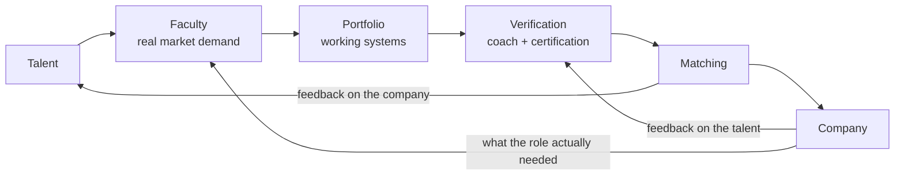

# MitHub

**The university in reverse.**

First we find the real market opportunity.
Then we teach exactly what's needed to take it.

[mithub.club](https://mithub.club) · [The Faculty of Revenue Engineering](https://mithub.club/facultad-gtm.html) · [The classroom](https://mithub.club/aula.html)

---

## The gap we're standing in

Two problems that look unrelated. They're the same problem seen from opposite ends.

**Companies can't find the people who cross the middle.** Sales finds an opportunity. The customer explains what they need. The solution looks possible. And then everything stalls — sales can't translate the need into a system, product has no time to customize, engineering gets incomplete requirements, the customer waits. Technology usually isn't what fails. What fails is the bridge between the market and the implementation.

**Exceptional talent is sitting on the wrong side of a barrier that has nothing to do with capability.** Language. Culture. Geography. Time zone. Credential systems that don't travel. A worldview that reads as "not a fit" to a recruiter skimming for keywords. The capability is there. The proof isn't legible to the people hiring.

We built a system that closes both at once, because neither closes alone.

---

## What a Revenue Engineer is

Someone who can walk the whole path without waiting for another department to translate for them:

| | |
|---|---|
| **Sit** with a customer and understand the problem | **Connect** tools, data and systems |
| **Spot** the commercial opportunity inside it | **Take** the solution to production |
| **Design** a solution that's actually workable | **Prove** the customer got a result |

The job titles vary — **Go-to-Market Engineer**, **Forward Deployed Engineer**, **Solutions Engineer**, **Revenue Engineer**, **AI Implementation Engineer**. The core capability doesn't: turning real market needs into implemented systems that produce value.

This is deliberately not a technical-only profile, and not a business-only profile. The people who can do only one half are not scarce. The people who can hold both are.

---

## The faculties

A faculty here is not a course catalog someone wrote from a syllabus. **A faculty is opened when the market demand is already visible and unserved**, and it's shaped by the operations we actually run.

| Faculty | Status |
|---|---|
| **Revenue Engineering** — GTM Engineering + Forward Deployment | Open · first generation |
| Next faculties | Opened when demand is proven, not before |

The rule that governs this: we don't teach what's trending. We teach what companies are currently failing to hire for. When that changes, the curriculum changes — and the mechanism that tells us it changed is described below.

---

## How talent is qualified

Not by attendance. Not by a quiz score. By **evidence a hiring manager can read in four minutes.**

Five dimensions feed a talent's standing:

| Dimension | What it measures | Why it's there |
|---|---|---|
| **Effort** | Consistency and depth of work over time, on a leaderboard | Talent is common. Finishing is not. |
| **Contributions** | What they gave back — reviews, docs, helping the cohort | The people worth hiring make the room better |
| **Portfolio** | Working systems they built, end to end | The only artifact that survives a skeptical reader |
| **Coach verification** | A career coach reviews the work and signs off on it | Stops self-reported skill from entering the pipeline |
| **Certification** | Issued by mitHub — **always backed by real work, never by theory** | A certificate that only proves attendance is noise |

**The standard we hold:** a mitHub certification is a claim we're willing to defend to the company that hires on it. That means it can't be earned by watching. Every certification traces back to something the person built, that someone verified, that a company could put into production.

---

## The matching loop

The two return arrows are the part most models skip, and they're the part that makes this work.

- **The company tells us how the talent actually performed.** Not a satisfaction survey — what held up, what didn't, what we failed to teach. That routes straight back into the curriculum and into how we verify.
- **The talent tells us how the company actually was.** Scope, treatment, whether the role matched the pitch. A company that burns talent stops receiving talent.

A closed loop is the difference between a school that guesses and a school that knows.

---

## Win-win, by system — not by goodwill

The incentives are arranged so that **nobody wins unless everyone wins.** That's a design decision, not a value statement.

| Party | Puts in | Gets out |
|---|---|---|
| **Talent** | Time, finished projects, willingness to be corrected | Full training at zero cost, a portfolio that proves capability, introductions where there's an opening |
| **Company** | Honest feedback on the talent, a real opportunity | Someone pre-verified against work, not against a résumé |
| **MitHub** | The training, the mentorship, the stack, the verification | We're paid when the talent produces value — not when they enroll |

Read the third row again, because it's the load-bearing one. **We don't get paid for enrollment.** There's no tuition to optimize, no funnel that profits from people who never finish. The only version of this where we win is the one where a real person ends up doing real work that a real company will pay for.

That's also why we say the uncomfortable part out loud: **we do not promise a guaranteed job.** We promise training at no cost, a portfolio that shows what you can do, and that we put you in front of an opening when you're ready. The rest is defended by your work. A system that promised more than that would be lying, and the lie would show up in the feedback loop within one cycle.

---

## What's public, and what never will be

We publish the machine. We don't publish the people inside it.

| Public — here, on purpose | Private — and staying that way |
|---|---|
| The model and how the loop closes | Individual scores and leaderboard standings |
| The five qualification dimensions | Talent identities, locations, personal circumstances |
| Faculty curricula and what each stage teaches | Which companies are in the pipeline, and their briefs |
| The certification standard we hold ourselves to | Employer feedback on named individuals |
| The rubrics — what "verified" actually requires | Offers, compensation, placement terms |

The line is simple: **anything that helps you judge whether the system is real is public. Anything that belongs to a person or a company is not.** Talent handed us their working history on the understanding that we'd represent it, not publish it. Companies told us what they're failing to hire for on the understanding that their competitors don't get to read it.

If you want to see inside, that's a conversation — not a repository.

---

## What's in this for you

**If you're talent** — you get the training free, and you get judged on what you can build instead of on where you were born or which university admitted you. If you're already good and the world hasn't noticed, this system is built specifically for your case. [Start here.](https://mithub.club/aula.html)

**If you're a company** — you get someone who has already been verified against real work by someone whose reputation depends on being right. And you get to shape what the next generation is trained on, by telling us what your last hire couldn't do.

**If you're an operator, mentor or career coach** — the verification layer only works if the people signing off are people whose judgment carries weight. That's a small group and we're building it deliberately.

---

## Where we are

First generation of the Faculty of Revenue Engineering. Training is free right now — that's a deliberate stage, not a discount. When it changes we'll say it straight, and anyone already inside stays inside.

We're building this in the open because the model should be judgeable before anyone commits time to it. The people it belongs to stay private.

---

**[mithub.club](https://mithub.club)** · contacto@mithub.club

*Made with AI and human judgment.*

